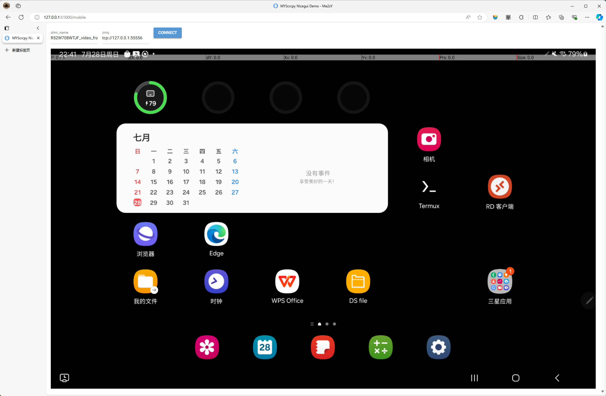

# MYScrcpy

python语言实现的一个 [Scrcpy](https://github.com/Genymobile/scrcpy/) 客户端。

采用 [DearPyGui](https://github.com/hoffstadt/DearPyGui) 作为主要GUI。
同时在某些控制代理场景，使用[pygame](https://www.pygame.org/)作为鼠标及键盘控制映射GUI。pygame提供了鼠标隐藏、按键事件监听等功能，
适用于第一人称相关应用的按键映射。

在5900x + gtx1080 + 三星Galaxy Tab S9 8gen2/小米11pro 888 1920x1080分辨率下， Pygame控制模式可以达到13~30ms的延迟。

使用SharedMemory，将视频帧通过内存共享，可以实现 [Nicegui](https://github.com/zauberzeug/nicegui) 的网页绘制展现、
[OpenCV](https://opencv.org/) 图像处理等。


## 特性

- [x] 有线连接安卓设备
- [x] 实现了视频流解析（H264），生成numpy.ndarray，可自行使用opencv、image等进行图形处理
- [x] 实现了音频流解析（FLAC）, 使用 [pyflac](https://github.com/sonos/pyFLAC) 解码，[pyaudio](https://people.csail.mit.edu/hubert/pyaudio/) 播放
- [x] 实现了控制按键映射，鼠标映射
- [x] 实现了UHID-Keyboard UHID-Mouse与鼠标点击混用，可以实现Android界面中鼠标与PC混用模式
- [x] 实现了SharedMemory，不同进程间通过内存低延迟共享视频画面
- [x] 实现了ZMQ通讯，使用ZMQ pull/push 对手机进行控制
- [x] 实现了DPG GUI下，鼠标滚轮缩放、滑动等功能
- [x] 实现了设备锁屏下，通过InputPad输入密码解锁功能
- [x] DPG GUI下设备翻转图像自动调整，无限制拉伸缩放等功能
- [x] 实现了Ctrl调节鼠标移动速度功能
- [x] 采用TwinWindow思路，解决DPG控件无法重叠问题，实现DPG控制映射编辑器（TPEditor）
- [x] 纯Pygame控制模式下，最低延迟在6ms
- [x] 实现Audio ZMQ Server, 以ZMQ发布模式，通过网络Socket传输音频流，可以实现远程声音传输、MIC监听等更多可能

## 基本使用

1. 使用pip install dist/myscrcpy-X.X.X.tar.gz 或者 克隆本项目至本地

2. 结构如下：
   1. **utils.py**
   定义基本工具类及各类参数
   2. **gui/dpg**
   DearPyGui 界面实现，包括视频绘制，鼠标事件，UHID鼠标、键盘输入，映射编辑等。
   3. **gui/pg**
   pygame 界面实现，包括视频绘制、鼠标事件、键盘事件控制等。
   4. **gui/ng**
   Nicegui Web UI, 使用 SharedMemory 读取视频Frame
   4. **controller/***
   视频流、音频流、控制流、设备控制器等
   5. **homepath/.myscrcpy/tps/*.json**
   保存TouchProxy配置文件，.json格式。

3. 程序引用使用，便于自行开发

```python
from myscrcpy.controller import *

device = DeviceFactory.device()
# device = DeviceController(DeviceFactory())


# Connect to Scrcpy
# Create a SocketController and pass to connect method
# None means NOT connect
device.connect(
   VideoSocketController(max_size=1366),
   AudioSocketController(audio_source=AudioSocketController.SOURCE_OUTPUT),
   ControlSocketController()
)

# create zmq
device.create_zmq_server()
sender = ZMQControlServer.create_sender()
sender.send(ControlSocketController.packet__screen(True))

# Get Frame np.ndarray RGB
frame = device.vsc.get_frame()
device.csc.f_set_screen(False)
...
```

4.使用GUI

安装
```bash
pip install myscrcpy-X.X.0.tar.gz
```

:exclamation: Ubuntu等Linux下 使用pyaudio 需要先安装portaudio
```bash
sudo apt install libportaudio-dev
```

运行DearPyGui GUI
```bash
python -m myscrcpy.run
```

运行pygame GUI （高速控制模式）

:exclamation: 使用该模式, 需要提前在DGP Gui下配置好相应按键映射

为追求性能，该模式剔除旋转等功能，设备发生旋转或应用切换横竖屏，会导致运行终止。
```bash
python -m myscrcpy.run -g
```


## 程序截图

主界面


Nicegui Web 界面 （DEMO）


按键映射编辑器


7ms延迟


## 所思所想
作为从 Scrcpy 1.X时代就开始使用的老玩家，感叹于Scrcpy的发展及神奇的功能的同时，也一直想做点什么。不过碍于有其他项目（~~懒~~）一直迟迟没有动手。 
直到遇到了[Scrcpy Mask](https://github.com/AkiChase/scrcpy-mask) 这一优秀项目，感觉我也要做点什么了。

遂于24年6月1日开始，阅读Scrcpy源码，使用python语言，借由pyav、adbutils、numpy、pyflac等优秀工具包，形成了MYScrcpy这一项目。

开发初期，是想解决在某些场景下，鼠标操作映射相关问题。随着不断开发，也产生许多涉及图形分析、AI接入（YOLO）、自动控制等方向的新想法。

MYScrcpy是MY（Mxx & ysY）系列的开始，接下来，将继续开发完善这一项目及相关应用。

目前项目为个人开发，时间、精力、水平有限，功能说明等文档方面会逐步完善。欢迎大家使用及指正。也可通过邮箱联系。如果后续有需要，也可以建群联系。

欢迎访问我的 [Bilibili](https://space.bilibili.com/400525682)，之后会录制一些操作及讲解视频，希望大家喜欢。

最后十分感谢我的挚爱在开发中给予的支持。 :heart_eyes:
