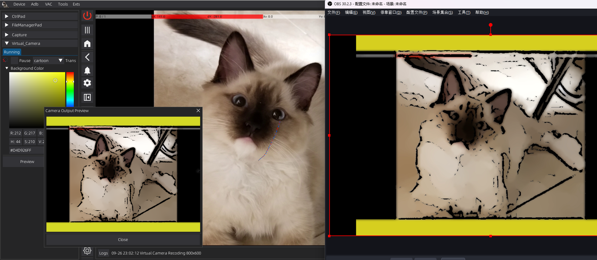
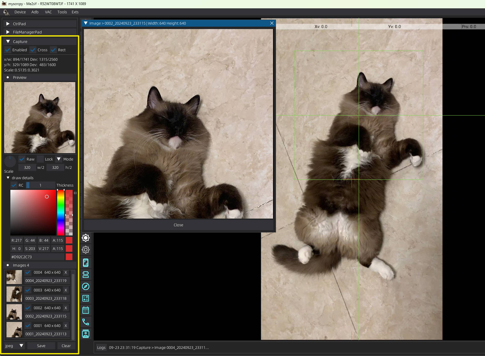

# MYScrcpy V1.6.5

### [中文简介](https://github.com/me2sy/MYScrcpy/blob/main/README.md)

A [**Scrcpy**](https://github.com/Genymobile/scrcpy/) client implemented in **Python**. 

Includes comprehensive video, audio, and control flow parsing and presentation. **Developer-friendly, Just pip install and ready to go!**

Uses [**DearPyGui**](https://github.com/hoffstadt/DearPyGui) as the main GUI. Supports Extensions, Window Position Record, Right-click gesture control, Virtual Cameras, File Manager, Chinese input, unlocking screen passwords, and other features.

In some control proxy scenarios, [**pygame**](https://www.pygame.org/) is used for mouse and keyboard control mapping GUI. 

Pygame provides features such as mouse hiding and key event listening, suitable for key mapping in **FPS**.

### :tv: Video Introduction: [BiliBili](https://www.bilibili.com/video/BV1DxWKeXEyA/)


## Features

### Extensions
#### VirtualCamera V0.1.1
  - Adjust to new callback
  - Automatically select the backend based on the current operating platform（OBS/unitycapture/v4l2loopback）
  - Supports output original size or custom size, custom background fill color.
  - Support output preview
  - Automatically switch between landscape and portrait mode
  - Support (Edges/Gray/Cartoon) Convert
    - > opencv-python Required
  - I start/stop | O pause/continued P | press then pause
  - 

#### Capture V0.1.2 (For AI train 640x640 or whatever size you need)
  - **0.1.2 WSAD adjust capture rect pos/size, e switch mode**
  - **0.1.1 Support Camera Stream Capture**
  - **0.1.1 Support Select Mode, use 'V' key**
  - CrossLine/Rect
  - Customizable screenshot frame size, with options for original or "what you see is what you get" (WYSIWYG) capture modes.
  - Use the 'C' key for taking screenshots, 'X' key to lock the screenshot frame position, and 'Q' to close the feature.
  - Capture the device's 1:1 actual graphics, ensuring high-resolution output.
  - Preview screenshot history, with options for custom save formats and batch saving.
  - Support for magnifier mode.
  - Support for customizing the color, random color, and thickness of CrossLine for increased visibility.
  - 

### Develop
- **1.6.5 NEW** [HOW TO Develop a extension](https://blog.csdn.net/weixin_43463913/article/details/142685828)
- **1.6.4 NEW** Customize extensions loading paths for convenient extensions development
- **1.6.4 NEW** Unify mouse and keyboard callback methods and parameters, add Action filters
- **1.6.3 NEW** Allow Extension to get mouse callback
- Function Description [Window.setup_session()](/files/doc/introduce/window__setup_session.md)
- Brand-new plugin architecture! Supports features such as configuration file injection.[**HowTo**](files/doc/help/extensions/Help_extensions_v1_6.md)
- Upgrade KVManager and ValueManager, with automatic registration and management.
- Supports output the original format streams of video and audio to facilitate your development work
- `pip install mysc[all]` and ready to go
- Session/Connection/Adapter/Args Framework, One Line And get A Image or Numpy.ndarray RGB
  - `Session(adb_device, video_args=VideoArgs(1200)).va.get_image()`
- Minimize references on demand. Core can be deployed in **Termux**, Web GUI in LAN. [**Installation Tutorial**](files/doc/MYScrcpy_with_Termux.md)

### GUI
- **1.6.0 NEW** Added a bottom prompt and log bar, providing timely reminders and log viewing capabilities.
- **1.6.0 NEW** Introducing a new plugin manager for managing plugins and custom configurations.
- **1.6.0 NEW** Support [uiautomator2](https://github.com/openatx/uiautomator2)
- File Manager with upload, download, delete and more [**HowTo**](files/doc/help/file_manager/Help_file_manager.md)
- Supports file transfer on Windows systems
  - Use the right-click gesture Down|Up to quickly copy
  - Alternatively, use VAC -> Control -> CopyToDevice
  - Select files or folders on the PC (supports multi-selection), then draw the copy gesture on the MYScrcpy interface to copy the selected files/folders to the device's /sdcard/MYScrcpy/ folder
  - Take a screenshot of the PC screen, then draw the copy gesture on the MYScrcpy interface to copy the screenshot to the device's /sdcard/DCIM/ folder
  - If text is selected, it will be copied to the device's clipboard
- Supports wired and wireless connected devices
- Support wireless port setting, automatic reconnect function after setting
- Support loading history connection records, automatic memory history connection records, fast connection
- It can configure the corresponding connection mode according to the device and save the connection parameters
    - For example, if using phone Camera mode, then video/audio configuration, control is closed and saved as Camera configuration combination
    - With cast screen, then all configuration, and save as the cast screen configuration combination
- Automatically record the size of the window according to the device and the current connection parameters, and record the position of the window before rotation.
  - There is no need to adjust the window position frequently when switching between landscape and portrait
- Support for Windows/Linux (no macOS devices yet, test later)
- Support heartbeat detection and automatic reconnection

### Video
- Support h264/h265 video stream parsing
- Support screen projection and camera projection at the same time according to the device conditions
- Support for resizing Windows proportionally
  - Equal scale to the original video scale
  - Pull the window for free scaling
  - Automatically scale the window to video based on height/width
- Support for virtual cameras
  - **CLI start ```mysc-t-vc```** [**HowTo**](files/doc/help/Help_tools_vc_v1.md)
  - On, off, switch devices at any time
  - Support OBS Virtual Camera /Unity Capture(windows)/v4l2loopback(Linux)

### Audio
- Supports opus/flac/raw
- Support switching sound output devices, with VB-Cables to simulate microphone input

### Control
- **1.6.0 NEW** Optimize the mouse controller
  - Support gesture switching feature space, gesture: DR
  - Support extension configuration injection
- **1.6.0 NEW** Added a new keyboard switcher
  - Use F12 switch mode(UHID/ADB/Ctrl), F11 switch control space
- TouchProxyEditor, supports keyboard, mouse and other control mapping methods, Windows/Linux applicable
- Support UHID-Mouse, can realize the Android interface mouse and PC mixed use
- Support UHID-Keyboard, simulate external Keyboard, directly input Chinese (Baidu, Sogou input method test passed)
- Support the lock screen and black screen of the device, through the InputPad password unlock function
- Support mouse wheel sliding, zooming and other functions
- Support right click gesture judgment, quick back, screenshot, control music playback
  - Support for creating a second virtual point with a left button to simulate two-finger operations
- Clipboard support
- Support ctrl to adjust the speed of mouse movement in special scenarios
- Sidebar multiple function keys

## Contact & Help

**If you have any questions, ideas, or suggestions while using this product, please feel free to contact me through the following methods:**

#### QQ Group: 579618095


#### Email: Me2sY@outlook.com

#### Blog: [CSDN](https://blog.csdn.net/weixin_43463913)

## Basic Usage

### 1.1 Pypi (Recommend)
```bash
# Full installation
pip install mysc[full]
# NOT myscrcpy... my-scrcpy already exists in pypi...


# Only Core
pip install mysc

# Use Gui then:
pip install mysc[gui]

# use Web GUI then:
pip install mysc[web]

# flac
pip install mysc[flac]

# opus
pip install mysc[opus]

# or mixed for example
pip install mysc[gui, opus]


# After install
# For a console
mysc-cli

# GUI without log console
mysc-gui
```

### 1.2 Package Install or clone the project
```bash
pip install mysc-X.X.X.tar.gz
pip install loguru adbutils numpy av pyaudio

# GUI
pip install pyperclip moosegesture dearpygui pygame pyvirtualcam 

# Web GUI
pip install nicegui

# flac
pip install pyflac

# opus
pip install pyogg opuslib
```

### 2.Project Structure:
1. **utils** Defines basic tool classes and various parameters
2. **gui/dpg** DearPyGui interface implementation including video rendering, mouse events, UHID mouse and keyboard input, mapping editor, etc.
3. **gui/pg** Pygame interface implementation including video rendering, mouse events, keyboard control, etc.
4. **gui/ng** _(DEMO) Nicegui Web UI，Video and Control support
5. **core/** Session, Connection, Video stream, audio stream, control stream, device controller, etc.
6. **extension/** Official Extensions
7. **~/.myscrcpy/** Localization configuration file, including running config file *.db, keypress mapping file tps/*.json
8. **tools/*** CLI Tools


### 3.For developer

```python
# 1.4.X Recommend to use New Core/Session 

from adbutils import adb

from myscrcpy.core import *
from myscrcpy.utils import *

# Connect to Scrcpy
# Create a Session

adb_device = adb.device_list()[0]
# or use 
# DeviceFactory.load_devices()
# adv_device = DeviceFactory.device_list()[0]
# adb_device = adb_device.adb_dev

session = Session(
   adb_device,
   video_args=VideoArgs(max_size=1200),
   audio_args=AudioArgs(),
   control_args=ControlArgs()
)


# Get RGB Frame np.ndarray
frame = session.va.get_frame()

# Get PIL.Image
image = session.va.get_image()

session.ca.f_set_screen(True)

session.ca.f_touch_spr(
   Action.DOWN,
   ScalePointR(.5, .5, 0),
   touch_id=0x0413
)


# 1.5.8 NEW
# Get Raw Video / Audio Stream Bytes from scrcpy server
video_conn = VideoAdapter.raw_stream(adb_device, VideoArgs(max_size=1366, video_codec=VideoArgs.CODEC_H264))
while True:
    video_raw_bytes = video_conn.recv(1024)
    # Your Code Here
    break
video_conn.disconnect()

audio_conn = AudioAdapter.raw_stream(adb_device, AudioArgs(audio_codec=AudioArgs.CODEC_OPUS))
while True:
    audio_raw_bytes = audio_conn.recv(1024)
    # Your Code Here
    break
audio_conn.disconnect()


...
```

### 4.Using the GUI
:exclamation: _On Ubuntu and other Linux systems, installing portaudio first_
```bash
sudo apt install build-essential python3-dev ffmpeg libav-tools portaudio19-dev
```

#### Run DearPyGui GUI
```bash
mysc-cli # With Log Console
mysc-gui # Only GUI

# or
python -m myscrcpy.run
```

#### Run Nicegui GUI (WEB DEMO)
```bash
python -m myscrcpy.gui.ng.main
```


## Screenshots

### Main interface


### Right-Click Gesture Control Feature


### Nicegui Web Interface（DEMO）


### Key mapping editor (TPEditor)


### Extension Manager


## Thoughts

As a long-time user of Scrcpy since the 1.X era, I am amazed by its development and magical features. I've always wanted to do something, but due to other projects (laziness), I never got started.

Until I encountered the excellent project [Scrcpy Mask](https://github.com/AkiChase/scrcpy-mask), I felt it was time to do something.

On June 1, 2024, I started reading Scrcpy source code, using Python language and leveraging excellent tools like pyav, adbutils, numpy, pyflac, and more to create the MYScrcpy project.

Initially, the goal was to solve mouse operation mapping issues in certain scenarios. As development progressed, many new ideas involving graphic analysis, AI integration (YOLO), automatic control, etc., emerged.

**MYScrcpy** is the beginning of the MY (Mxx & ysY) series. Next, I will continue to develop and improve this project and related applications.

Currently, the project is developed personally, with limited time, energy, and skill. The documentation and feature descriptions will be gradually improved. Everyone is welcome to use and provide feedback. You can also contact me via email. If needed, a group can be created for contact.

Welcome to visit my [Bilibili](https://space.bilibili.com/400525682), where I will record some operational and explanatory videos. Hope you enjoy them.

Finally, I deeply appreciate the support from my beloved during the development. :heart_eyes:


## Acknowledgements

Thanks to [**Scrcpy**](https://github.com/Genymobile/scrcpy/) Project and Author [**@rom1v**](https://github.com/rom1v)
There is not MYScrcpy without Scrcpy.

Thanks to the packages/projects and the authors. Thanks to your efforts, we have such a great software development environment.

Thanks to all the users for your support and assistance. Hope that MYScrcpy can become a handy tool and helper for you.


## DECLARE

This project is intended for educational purposes (graphics, sound, AI training, etc.) , Android testing or just for fun.

**ATTENTION PLEASE:**

1. Enabling the mobile debugging mode carries certain risks, such as data leakage, and it is important to ensure that you understand and can mitigate these risks before using it.
2. **NEVER** use this project for illegal or criminal activities.

The author and this project are not responsible for any related consequences resulting from the above usage, and you should use it at your own discretion.

## ChangeLog
- 1.6.5
  - Support MuMu emulator
- 1.6.4
  - Customize extensions loading paths for convenient extensions development
  - Unify mouse and keyboard callback methods and parameters, add Action filters
  - WSAD adjust capture rect pos/size, e switch mode
- 1.6.3
  - update capture extension
  - support extension mouse register and callback
  - fix bugs
- 1.6.2 New VirtualCam Extension
- 1.6.1 Fix Bugs
- 1.6.0
  - Supports [uiautomator2](https://github.com/openatx/uiautomator2)
  - New Keyboard Controller, New Mouse Controller
  - Log Manager
  - Fixed the defect of window flickering during adjustment, and the DPG crash defect.
  - Brand-new plugin architecture, featuring plugin injection and a plugin manager
- 1.5.10 Extensions Support
- 1.5.9 File Manager with upload, download, delete and more
- 1.5.8 Support Copy Files or Dirs or ScreenShot from pc to device
- 1.5.8 Raw Video/Audio Stream Output
- 1.5.7 CLI Virtual Camera
- 1.5.5 Update Nicegui Gui for termux
- 1.5.4 Reduce CPU usage
- 1.5.3 Update Readme
- 1.5.3 OPUS available
- 1.5.0 **pypi** support. Use `pip install mysc` or with gui: `pip install mysc[gui]`. then run `mysc-gui` or `mysc-cli` (with console)
- 1.4.2 With [moosegesture](https://github.com/asweigart/moosegesture), Right-click gesture control functionality available, supporting features such as simulating a second touch point, line-based undo, volume adjustment, media playback, and more
- 1.4.1 Managing Configuration with SQLite
- 1.4.0 
  - Introducing the brand-new Core/Session/Connection/Utils architecture
  - Record the position of window before rotation
  - Support for heartbeat detection with automatic reconnection upon disconnection
  - Device-to-PC clipboard supported
  - Optimize the key mapping strategy for Linux compatibility
  - Provide more control buttons
- 1.3.6 Web Interface (DEMO) by Nicegui with video and UHID keyboard/mouse
- 1.3.3 Support select audio output devices, With VB-Cables you can simulate microphone input
- 1.3.2 Append [pyvirtualcam](https://github.com/letmaik/pyvirtualcam?tab=readme-ov-file),support OBS virtual camera.
- Supports saving connection configurations and window size.
- Supports wireless connection, connection history, and quick connect features, eliminating the need for complicated command-line input.
- Supports proportional window resizing and freeform stretching.
- Support for reconnecting after disconnection, connection history, and automatic reconnection attempts
- Support for H265 Video Stream
- Video stream parsing (H264) to generate numpy.ndarray for graphic processing with OpenCV, image, etc.
- Audio stream parsing (FLAC) with [pyflac](https://github.com/sonos/pyFLAC) for decoding and [pyaudio](https://people.csail.mit.edu/hubert/pyaudio/) for playback
- Control key mapping and mouse mapping
- Mixed use of UHID-Mouse and mouse clicks, enabling mixed use of mouse on Android and PC interfaces
- UHID-Keyboard for simulating an external keyboard, supporting direct Chinese input (tested with Sogou Input Method)
- Mouse wheel zoom, scroll functions under DPG GUI
- Unlock device screen using InputPad to input password
- Automatic adjustment of device video stream rotation and unrestricted zooming under DPG GUI
- Adjust mouse movement speed with Ctrl In Game Mode
- TwinWindow approach to solve DPG widget overlap issues, implementing DPG control mapping editor (**TPEditor**)
- Minimum latency of 7ms in pure Pygame control mode

## Development Plan

- apk_manager
- Using examples and tutorials
- twisted/fastapi interface
- YOLO and train tools
- Video and audio recording
- WebRTC