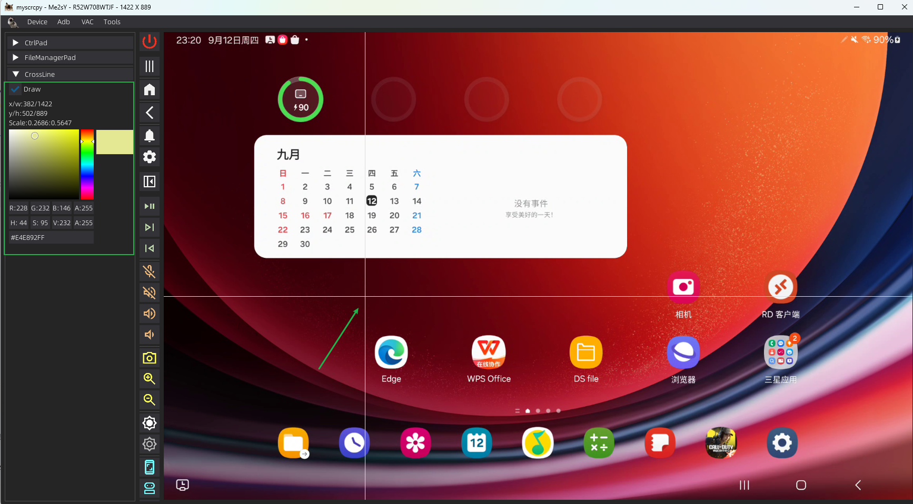

# Tools Help
## Extensions / 众人拾柴火焰高

## 很抱歉，现已弃用
### 欢迎切换至1.6.0 插件体系，支持配置文件注入，MD5校验，按键及鼠标手势注册管理。写法更简单，结构更清晰。

~~Extensions / 插件现已加入MYScrcpy 1.5.10~~

通过继承```MYScrcpyExtension```，重写相关方法，即可将你的功能以插件形式加入MYScrcpy GUI。尽情创造吧！

### 实现方法及示例

#### 本示例通过构建一个十字线插件，在主界面显示十字线，并在侧边控制面板显示鼠标坐标
1. 假设该插件命名为 Crossline
2. 创建一个python module 标准目录结构

```bash
|- mysc_ext_001_Crossline
|-- __init__.py
|-- obj.py
```
> **文件命名规范**:
> 
> mysc_ext_NNN_CLSname[*_xxx]
> 
> mysc_ext_ 固定开头，用于自动加载识别
> 
> NNN 3位加载序号 000最低 图层也为最低位，可被高层图层覆盖
> 
> CLSname 为插件类名，大小写敏感
> 
> [*_xx]后可加版本信息等，加载时自动忽略，
> 
> 例如 **mysc_ext_001_Crossline_V100_xxx_yyy**
> 
> module 中 必须包含 ```__init__.py``` 文件, 该文件为引用入口

> 另:若功能简单，可不采用 module 结构，直接创建单python文件 
> 
> 例如：**mysc_ext_001_Crossline_V100_xxx_yyy.py**

3. 在```obj.py```中继承插件类```MYScrcpyExtension```，并重写部分方法以实现相应功能 （obj.py可任意命名，无固定要求）

```python
# obj.py

__all__ = [
    'Crossline'
]

import dearpygui.dearpygui as dpg

# 引入
from myscrcpy.extensions import MYScrcpyExtension, ExtRunEnv

# 继承 MYScrcpyExtension
class Crossline(MYScrcpyExtension):
    
    
    # 重写 register 方法
    # 此方法在 window gui 加载新设备时调用
    # 需返回实际对象
    @staticmethod
    def register(*args, **kwargs):
        return Crossline()

    
    # 重写 run 方法
    # 此方法在 register 创建实例后调用，
    # 方法接收 ExtRunEnv 参数，该参数包含 Window 运行环境
    def run(self, ext_run_evn: ExtRunEnv, *args, **kwargs):
        """
            程序入口
        :param ext_run_evn:
        :param args:
        :param kwargs:
        :return:
        """
        self.ext_run_env = ext_run_evn
        self.draw_pad()
        self.layer = ext_run_evn.vc.register_layer()

        with dpg.handler_registry() as self.tag_hr:
            dpg.add_mouse_move_handler(callback=self.draw_cross)
    
            
    # 重写 stop 方法
    # 此方法在断开设备连接时调用
    # 用于清除 控制面板、界面等
    def stop(self):
        """
            停止进程
        :return:
        """
        dpg.delete_item(self.layer)
        dpg.delete_item(self.tag_hr)

    # -------------------------------------------------------------------------
    # 以下为本插件功能方法，根据插件功能不同，自行创建，无固定要求
    
    def __init__(self, **kwargs):
        super().__init__(**kwargs)

        self.layer = dpg.generate_uuid()

        self.is_draw = False
    
    # 绘制十字线
    def draw_cross(self, sender, app_data):
        """
            绘制十字线
        :param sender:
        :param app_data:
        :return:
        """
        try:
            dpg.delete_item(self.layer, children_only=True)
        except:
            ...
        
        if self.is_draw and dpg.is_item_hovered(self.ext_run_env.vc.tag_dl):
            x, y = dpg.get_drawing_mouse_pos()
            w, h = dpg.get_item_rect_size(self.ext_run_env.vc.tag_dl)
            
            # 画线
            dpg.draw_line(
                [x, 0], [x, h], parent=self.layer, color=dpg.get_value(self.tag_cp)
            )
            dpg.draw_line(
                [0, y], [w, y], parent=self.layer, color=dpg.get_value(self.tag_cp)
            )
            
            # 鼠标坐标信息
            dpg.set_value(self.tag_info, f"x/w:{x:.0f}/{w} \n y/h:{y:.0f}/{h} \n Scale:{x/w:>.4f}:{y/h:>.4f}")


    def switch(self, sender, app_data):
        """
            切换开关
        :param sender:
        :param app_data:
        :return:
        """
        self.is_draw = app_data
        if not self.is_draw:
            dpg.delete_item(self.layer, children_only=True)

    def draw_pad(self):
        """
            绘制面板
        :return:
        """

        # 在功能面板区，绘制控制面板，设置 parent = ExtRunEnv.tag_pad 将本插件功能面板挂载到 Window 左侧功能面板区
        with dpg.collapsing_header(label='CrossLine', parent=self.ext_run_env.tag_pad):
            dpg.add_checkbox(label='Draw', default_value=self.is_draw, callback=self.switch)
            self.tag_info = dpg.add_text('')
            self.tag_cp = dpg.add_color_picker()
```

4. 在 ```__init__.py``` 中，引用并暴露插件类，供 Window 调用
```python
# __init__.py

__all__ = [
    'Crossline'
]

# 引入插件类
from .obj import Crossline
```

5. 将module文件夹，拷贝至```~/.myscrcpy/extensions/``` 路径下: ```~/.myscrcpy/extensions/mysc_ext_001_Crossline```
> windows系统路径为 c:\\User\\YOUR\\.myscrcpy\\extensions\\

6. 运行MYScrcpy GUI 查看插件加载及运行效果



### 类及方法简介

---

```python
# ExtRunEnv 运行环境 dataclass 包含:
# window 运行窗口对象
# session 为 设备 Session
# adb_device 为 当前设备 AdvDevice 对象
# vc 为 实际显示页面
#   通过调用 vc.register_layer() 方法 创建一个 draw_layer, 并得到 draw_layer tag
#   可自行绘制图形
# tag_pad 为 左侧功能面板的父 tag
#   通过新增控件，设置 parent=tag_pad 将控件挂载到 左侧功能面板
#   使用 Dearpygui 控件
#   详见 https://dearpygui.readthedocs.io/en/latest/
```

### 注意

---

## 1. 因加载插件暴露设备相关信息，通过方法可获取安卓设备信息，并进行操作。在选择插件时一定要仔细甄别，选择加载安全的插件，避免产生安全风险！
## 2. 不可开发违法及恶意插件！产生不良后果，由恶意插件开发者承担全部责任！与本项目及作者无关！
### 3. 插件功能需 mysc 版本 >= 1.5.10 使用 ```pip install -U mysc``` 获取最新版本后使用